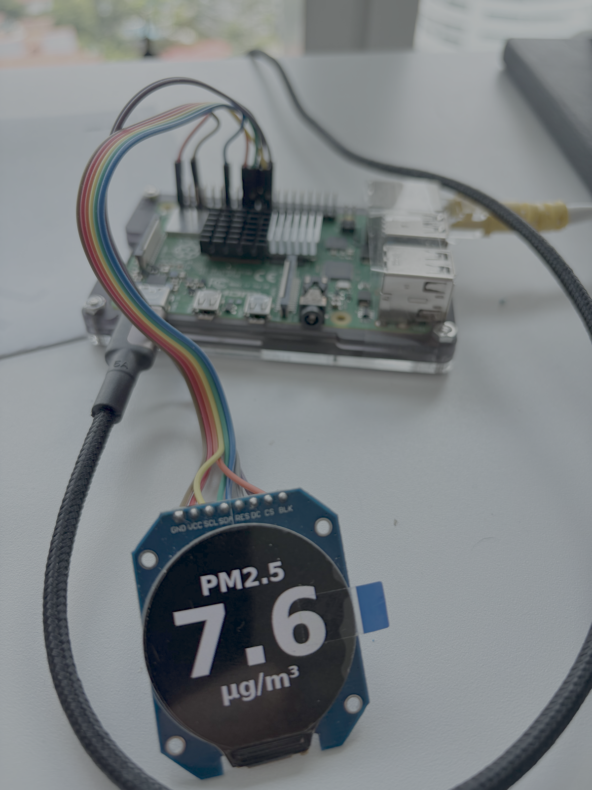

# RPi Watch

RPi Watch is a Raspberry Pi app that renders MQTT metrics onto a 240x240 GC9A01 round SPI display.

Current working display modes:
- single metric with title, unit, and trailing sparkline
- PM bars for `pm_1_0`, `pm_2_5`, `pm_4_0`, and `pm_10_0`
- configurable metric ring with threshold-based color gradient

The app subscribes once to one MQTT topic, stores the full payload plus recent history, and chooses what to render locally.

Current hardware display state:



## Hardware

- Raspberry Pi with SPI enabled
- GC9A01 round SPI display
- MQTT broker reachable on the local network

Recommended wiring for the current config:

| Display | Pi BCM | Header Pin |
|---|---:|---:|
| `SCLK` | `GPIO11` | `23` |
| `MOSI` | `GPIO10` | `19` |
| `CS` | `GPIO8` | `24` |
| `DC` | `GPIO25` | `22` |
| `RST` | `GPIO27` | `13` |
| `BLK` | `GPIO18` | `12` |
| `VCC` | `3V3` | `1` |
| `GND` | `GND` | `6` |

## Quickstart

Enable SPI first:

```bash
sudo raspi-config
```

Then install system dependencies:

```bash
sudo bash setup.sh
```

The renderer expects a scalable system font and `setup.sh` installs the default one used by `config/config.yaml`:

```bash
sudo apt-get install -y fonts-dejavu-core fontconfig
ls /usr/share/fonts/truetype/dejavu/DejaVuSans-Bold.ttf
fc-match "DejaVu Sans:style=Bold"
```

Install Python dependencies:

```bash
python3 -m venv venv
source venv/bin/activate
pip install --upgrade pip setuptools wheel
pip install -r requirements.txt
```

Run the app:

```bash
PYTHONPATH=src python3 -m rpi_watch.main
```

For production on the watch, run the app under `systemd` so it survives SSH logout and reboot:

```bash
systemctl status rpi_watch
sudo systemctl restart rpi_watch
sudo journalctl -u rpi_watch -f
```

If the service is not installed yet, create `/etc/systemd/system/rpi_watch.service` with an `ExecStart` that points at your repo checkout and virtualenv, then enable it:

```ini
[Unit]
Description=RPi Watch Display App
After=network-online.target
Wants=network-online.target

[Service]
Type=simple
User=pi
WorkingDirectory=/home/pi/rpi_watch
Environment=PYTHONPATH=/home/pi/rpi_watch/src
ExecStart=/home/pi/rpi_watch/venv/bin/python3 -m rpi_watch.main
Restart=always
RestartSec=5

[Install]
WantedBy=multi-user.target
```

```bash
sudo systemctl daemon-reload
sudo systemctl enable --now rpi_watch
```

## Configuration

Primary runtime config is [`config/config.yaml`](config/config.yaml).

Key sections:
- `display`: SPI bus, control pins, refresh rate, `madctl`
- `mqtt`: broker host, port, topic, QoS
- `state`: bounded cache plus append-only receive log paths
- `metric_display`: layout mode, fonts, labels, sparkline settings, PM bar colors, ring thresholds

The current layout switch is:

```yaml
metric_display:
  layout_mode: "single_metric"   # single_metric, pm_bars, metric_ring
```

Examples:

```yaml
metric_display:
  layout_mode: "single_metric"
  metric_key: "pm_2_5"
  show_sparkline: true
  sparkline_points: 10
```

```yaml
metric_display:
  layout_mode: "pm_bars"
  pm_bars_title: "PARTICLES"
  pm_bars_unit_label: "µg/m³"
```

```yaml
metric_display:
  layout_mode: "metric_ring"
  ring_field: "temp"
  ring_min_value: 0.0
  ring_max_value: 40.0
  ring_start_angle: 135.0
  ring_end_angle: 405.0
```

The watch also keeps a durable append-only MQTT receive log for later extraction and model training:

```yaml
state:
  cache_path: "data/metric_store.json"
  history_size: 50
  record_path: "data/mqtt_records.jsonl"
```

`record_path` is written in JSONL format, one received MQTT message per line, with:
- host-side receive timestamp (`received_at`, `received_at_iso`)
- MQTT topic
- selected display field/value
- flattened payload fields
- the original raw payload string

## Testing And Demos

Render components individually:

```bash
PYTHONPATH=src python3 scripts/test_components.py
```

Render layout demos to `/tmp`:

```bash
PYTHONPATH=src python3 scripts/demo_layouts.py
```

Check MQTT from the watch Pi:

```bash
PYTHONPATH=src python3 scripts/test_mqtt_subscription.py --timeout 20
```

## Project Structure

```text
rpi_watch/
├── config/
│   └── config.yaml
├── src/rpi_watch/
│   ├── main.py
│   ├── display/
│   │   ├── gc9a01_spi.py
│   │   ├── renderer.py
│   │   ├── components.py
│   │   ├── layouts.py
│   │   └── fonts.py
│   ├── metrics/
│   │   └── metric_store.py
│   └── mqtt/
│       └── subscriber.py
├── scripts/
│   ├── demo_layouts.py
│   ├── test_components.py
│   └── test_mqtt_subscription.py
├── docs/
│   ├── README.md
│   ├── guides/
│   ├── reference/
│   ├── status/
│   └── images/
├── setup.sh
└── README.md
```

## Troubleshooting

If text renders tiny or glyphs are broken:

```text
WARNING - No scalable font source could be loaded
```

Install and verify the default font:

```bash
sudo apt-get install -y fonts-dejavu-core fontconfig
ls /usr/share/fonts/truetype/dejavu/DejaVuSans-Bold.ttf
fc-match "DejaVu Sans:style=Bold"
```

If MQTT connects but no values appear, verify the broker and topic independently:

```bash
mosquitto_sub -h 192.168.0.214 -t airquality/sensor -v
```

`mosquitto_sub` is only a foreground diagnostic tool. It exits when the shell exits, unlike `rpi_watch.service`.

## Additional Docs

- [docs/README.md](docs/README.md): documentation index
- [docs/guides/SETUP_GUIDE.md](docs/guides/SETUP_GUIDE.md): step-by-step Pi setup
- [docs/TODO.md](docs/TODO.md): backlog, including animated metric rotation
